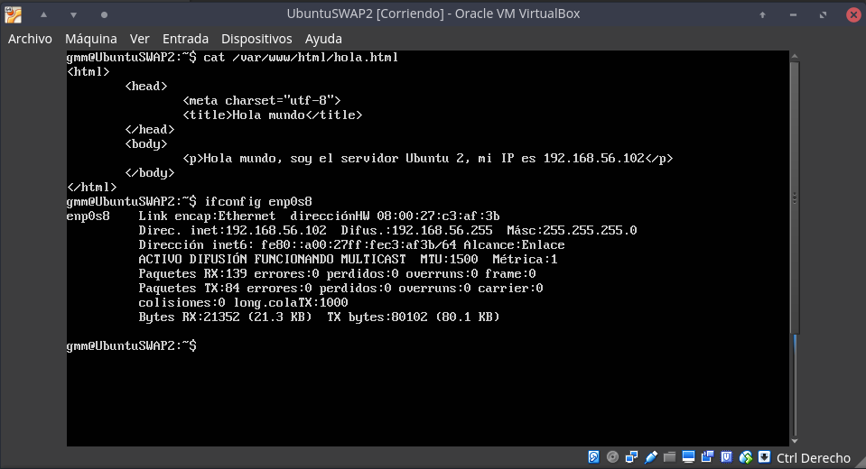
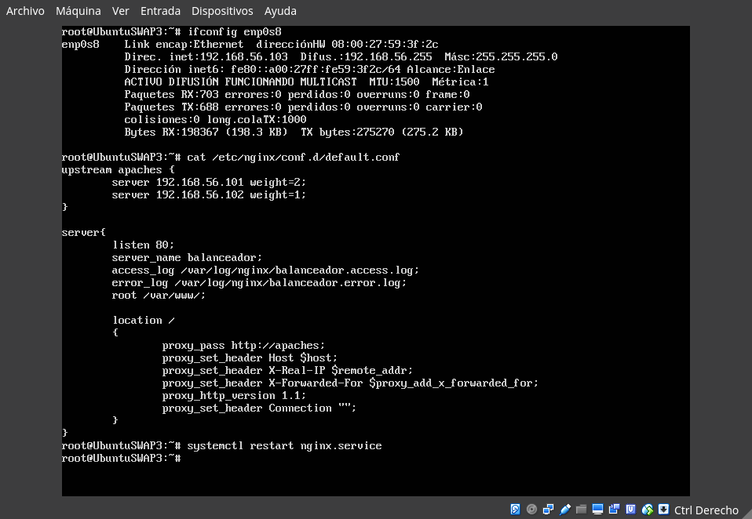
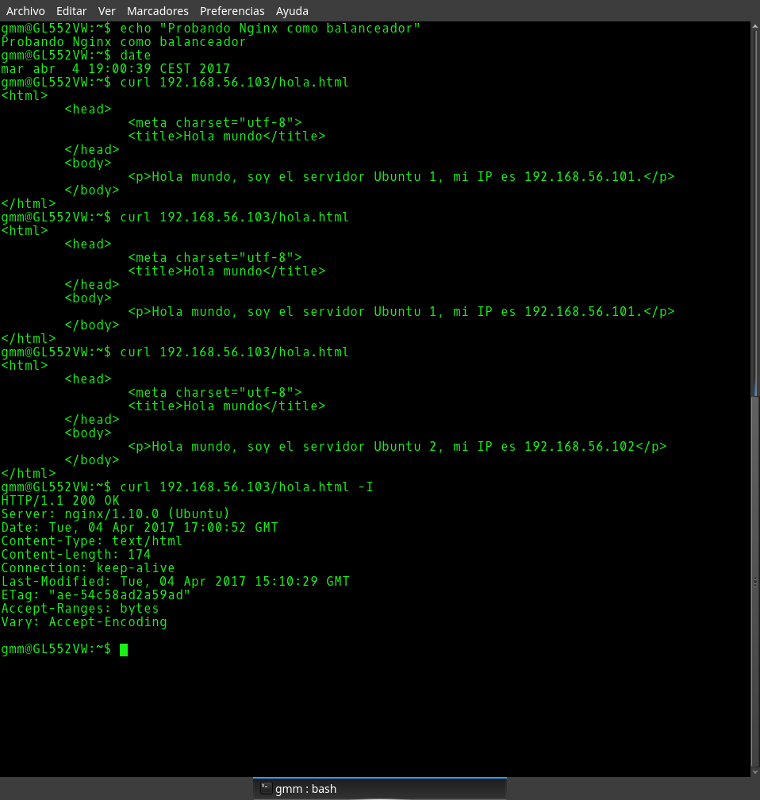
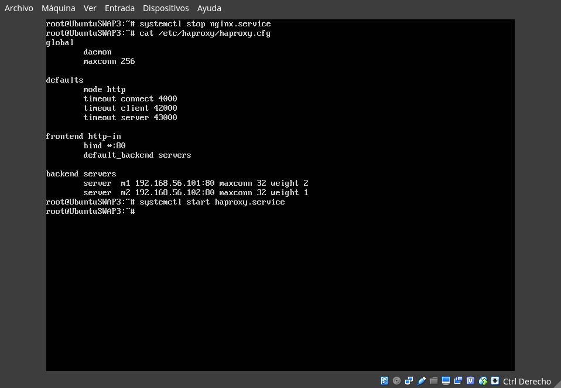
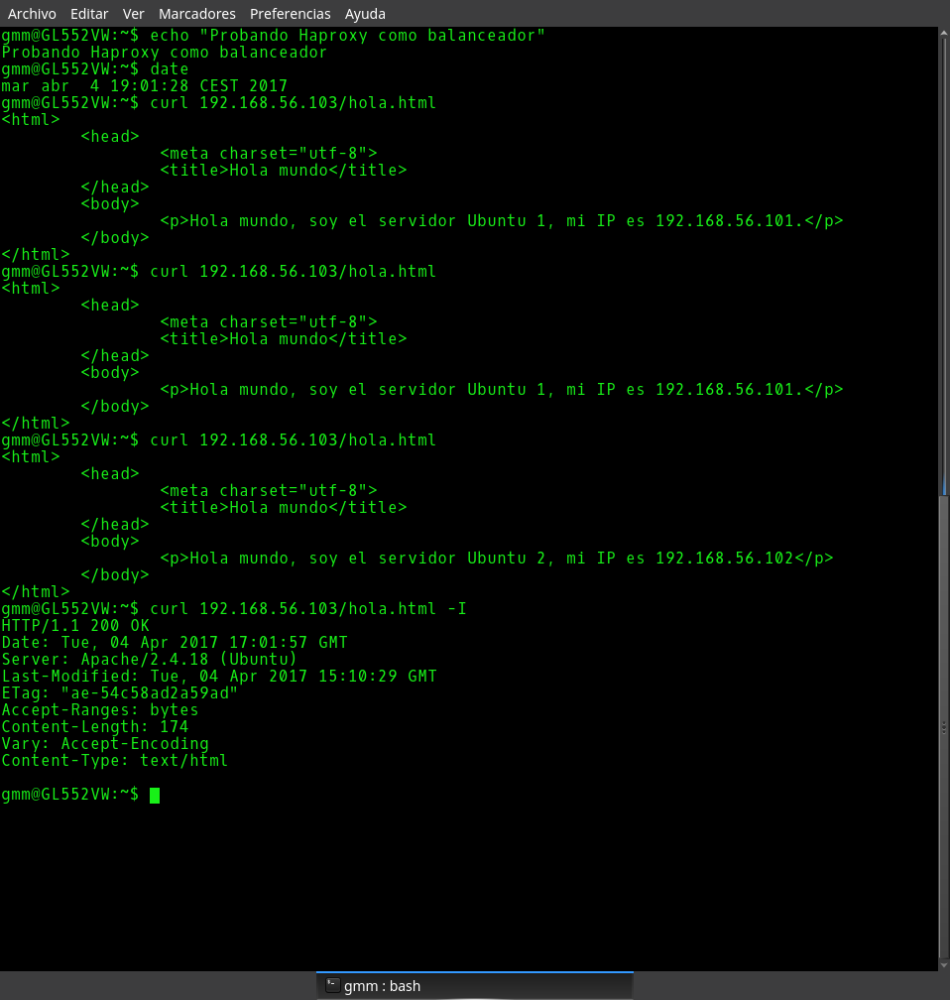
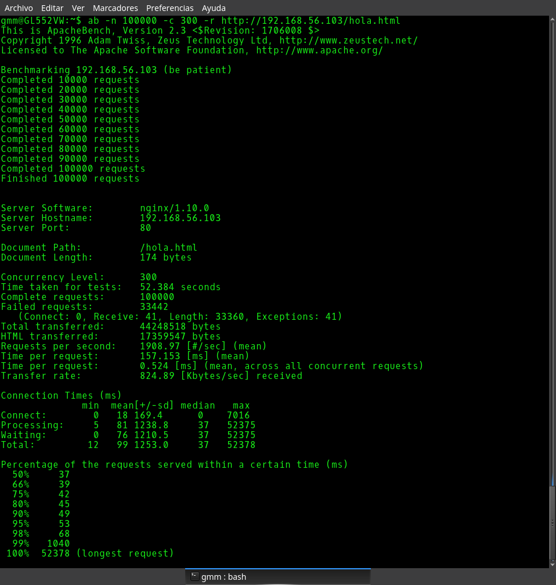
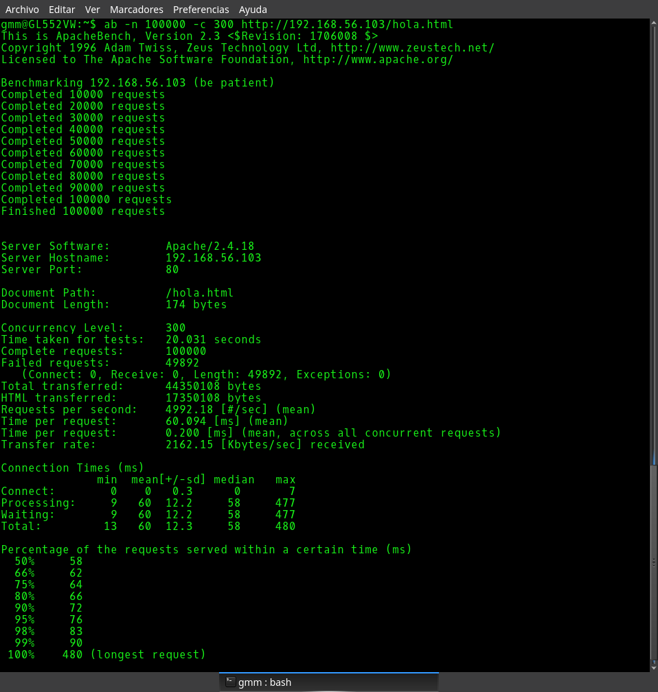

# Práctica 3

#### Guillermo Montes Martos | 04/04/2017

### 0. Pasos iniciales
Lo primero que tendremos que realizar para esta práctica será instalar una tercera máquina virtual (se ha elegido el mismo SO, Ubuntu 16.04 server). Esta deberá de tener conexión con las otras dos máquinas creadas anteriormente.

Por otro lado, se han creado sendos ficheros *HTML* identificativos en ambos servidores, de manera que, cuándo comprobemos el funcionamiento del balanceador, podamos observar rápidamente si este está funcionando.




<br>

###  1. Instalación de Nginx como balanceador de carga
Para instalarlo en nuestra tercera máquina, tendremos que ejecutar la siguiente sentencia tal y como se explica en el guión de prácticas:

```shell
sudo apt-get install nginx
```

Una vez instalado, la configuración inicial estará preparada para que funcione como **servidor web** y no como balanceador de carga. Para cambiar esto, necesitamos modificar el fichero de configuración */etc/nginx/conf.d/default.conf* (si no existe, es necesario crearlo). Este debe de quedar de la siguiente manera.



Debemos resaltar que, tal y como se pide en el guión de prácticas, se ha establecido el balanceador de manera que la primera máquina reciba el **doble de carga** que la segunda. Por último, borramos el fichero /etc/nginx/sites-enabled/default, ya que puede darnos problemas a la hora de usar el balanceador, y reiniciamos el servicio.

Con la configuración completada, pasamos a probar su funcionamiento desde un terminal en la máquina host, haciendo uso del comando curl. Para ello, escribimos la siguiente sentencia...

```shell
curl 192.168.56.103/hola.html
```

... dónde la dirección IP introducida se corresponde con la dirección IP de la máquina balanceadora y hola.html es el archivo HTML identificativo creado anteriormente en ambos servidores web.



Tal y como podemos comprobar, el funcionamiento es el esperado, ya que, si comparamos la carga asignada a cada servidor real, asigna el doble a la primera, tal y como se pidió en el guión. Además, sabemos que Nginx mete una marca identificativa en los **headers** de la página solicitada. Así, nos descargamos los headers de la página añadiendo la opción *-I* a la sentencia *curl* y comprobamos como funciona correctamente.

<br>

### 2. Instalación de Haproxy como balanceador de carga
Para la configuración de Haproxy, tendremos que seguir un proceso similar al seguido anteriormente con Nginx. El primer paso será instalarlo mediante la orden:

```shell
sudo apt-get install haproxy
```

Una vez completada la instalación, procedemos a su **configuración**. Para ello, debemos de borrar el contenido por defecto del fichero */etc/haproxy/haproxy.cfg* e introducir el siguiente:



Guardado el fichero, iniciamos el servicio Haproxy (no sin antes comprobar que hemos parado el **proceso correspondiente a Nginx**, ya que este puede interferir apropiándose del puerto 80) y comenzamos la prueba desde la terminal de la máquina host.



Podemos observar como los resultados obtenidos son los adecuados según la configuración solicitada en el guión de prácticas. Por otro lado, también podemos ver como Haproxy no añade su huella a los headers de la página solicitada, a diferencia de Nginx, el cual sí lo hacía.

<br>

### 3. Pruebas de alta carga en ambos balanceadores

Para llevar a cabo esta prueba, se ha elegido la conocida herramienta Apache Benchmark (*ab*). Si no estuviese instalada, sería tan fácil como ejecutar:

```shell
sudo apt-get install apache2-utils
```

De esta manera, ejecutaremos *ab* en una terminal de nuestra máquina host con los siguientes parámetros:

```shell
ab -n 100000 -c 300 http://192.168.56.103/hola.html
```

Este benchmark ejecutará 100000 peticiones a nuestra **granja web** con una concurrencia de 300. Se ha elegido el mismo fichero *HTML* que se consultó en los anteriores apartados. Ha sido necesario añadir el parámetro *-r* cuando se ejecutó para Nginx, ya que, debibo al tiempo que tardaba, se producía una desconexión. Así, los resultados obtenidos para Nginx y para Haproxy son, respectivamente:





Como podemos observar claramente, los resultados obtenidos con **Haproxy** como balanceador de carga son mucho mejores si los comparamos con los obtenidos con Nginx.

Por un lado, vemos como el **tiempo medio por petición** en la prueba realizada con Haproxy es casi **0.1 ms** más rápido que en la prueba realizada con Nginx, un tiempo considerable en pruebas de alta carga. Por otro lado, comprobamos como el número de **peticiones fallidas** realizadas con Nginx como balanceador es mayor, fallando este en, aproximadamente, el **50%** de las peticiones, mientras que con Haproxy este porcentaje se reduce al **33%**.

Como conclusión, podríamos afirmar que, según las pruebas realizadas, **Haproxy** es un mejor balanceador de carga que Nginx y que, por lo tanto, es más recomendable su uso, ya sea por el tiempo medio necesario por petición o por su fiabilidad, algo comprensible por otra parte si tenemos en cuenta que la principal función de Nginx es la de servidor web.
