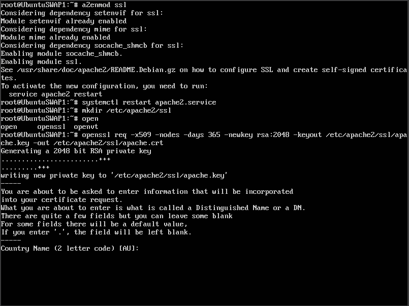

# Práctica 4

#### Guillermo Montes Martos | 06/05/2017

<br>

### 1. Instalación del certificado SSL

El primer paso de la práctica consiste en la instalación de un **certificado SSL autofirmado**. No es recomendable el uso de este tipo de certificados pero nos vale para la realización de la práctica.

Así pues, en cualquiera de las dos máquinas con servidor web, activamos el módulo SSL en apache y creamos el certificado autofirmado. Durante su creación, nos pedirá una serie de datos que tendremos que rellenar.



Una vez creado, tendremos que especificar en el archivo de configuración */etc/apache2/sites-available/default-ssl.conf* la ruta de los archivos creados.


Hecho esto, activamos el sitio SSL y reiniciamos apache mediante los siguientes comandos, comprobando con el navegador como el certificado se encuentra correctamente instalado. Obviamente, será necesario repetir este proceso con la otra máquina con apache, copiando el certificado a esa máquina.

```shell
a2ensite default-ssl
systemctl restart apache2
```


El último paso de esta parte será la configuración del certificado en la máquina balanceadora. Seguimos la recomendación del profesor y realizaremos la prueba en Nginx. Así, copiamos el certificado de la misma manera en que lo hicimos en las otras máquinas y añadimos las líneas necesarias al fichero de configuración */etc/nginx/conf.d/default.conf*.


<br>


### 2. Configuración del cortafuegos

La segunda parte de la práctica consiste en configurar el cortafuegos de las máquinas implicadas. Tal y como se expone en el guión, realizaremos esta configuración en la máquina balanceadora, aunque sin éxito. Al parecer, hay algún tipo de problema que bloquea el puerto HTTPS de salida, aún estableciendo la configuración adecuada. Es por ello por lo que pasamos a realizar esta configuración en las máquinas con servidores web. Para ello, usaremos el script provisto por el profesor y lo ejecutaremos.


Una vez realizado, comprobamos que la máquina sirve contenido correctamente y así es.


Con el cortafuegos bien configurado, tendremos que asegurarnos que este script se ejecuta cada vez que arrancamos el servidor. Para ello, añadimos la siguiente línea al fichero */etc/crontab* de nuestra máquina balanceadora:

```shell
@reboot     root        sh /home/gmm/reglas_iptables.sh
```

Realizaremos la misma configuración en la segunda máquina servidora.

<br>


### 3. Uso de certificados de Certbot [Opcional]

[Certbot](https://certbot.eff.org/), antes conocido como Let's Encrypt, es un cliente automático de **creación de certificados SSL/TLS para servidores web**. Esta alternativa de código abierto es una buena opción si queremos un certificado de calidad (frente a los certificados autofirmados) y no queremos gastar dinero (frente a los certificados de entidades de certificación).

Para realizar esta prueba, disponemos de un VPS previamente contratado y configurado, además de un nombre de dominio. 

En la página principal de [Certbot](https://certbot.eff.org/), podemos introducir el SO y el servidor web instalado, de manera que obtenemos un sencillo tutorial que nos explica como realizar la instalación. En nuestro caso, se realizará sobre un VPS con Ubuntu 16.04 y Apache2 como servidor web, así que podemos acceder al tutorial mediante la URL [https://certbot.eff.org/#ubuntuxenial-apache](https://certbot.eff.org/#ubuntuxenial-apache).

Lo primero que tendremos que hacer es añadir el repositorio de Certbot e instalar el cliente mediante los siguientes comandos.

```shell
sudo add-apt-repository ppa:certbot/certbot
sudo apt-get update
sudo apt-get install python-certbot-apache 
```

Una vez instalado tenemos dos opciones. La primera es dejar que el cliente configure **automáticamente** nuestro servidor web para el uso de HTTPS, además de crear el certificado. La segunda pasa por la creación del certificado y la posterior configuración manual. Por facilidad, se ha escogido la primera opción.

NOTA: se han tapado ciertos datos que se consideran sensibles, tales como el dominio o la dirección de correo.


Como se puede comprobar, lo primero que nos pedirá el cliente serán los dominios que queremos abarcar con el certificado. Posteriormente, se nos pedirá un correo electrónico para avisarnos sobre las novedades del certificado, como, por ejemplo, cuando se acerque la fecha de caducidad. Aceptamos las condiciones de uso y nos aparece un problema con respecto al módulo SSL a usar. Esto ocurre porque ya se activó anteriormente HTTPS en este servidor web de una manera alternativa. Por último, escogemos que todas las conexiones sean mediante HTTPS y comprobamos su funcionamiento, el cual es correcto.


Como se comentó, este tipo de certificados tiene fecha de caducidad, pero gracias al cliente Certbot, no tendremos que preocuparnos de ello, ya que él se encarga de renovarlo automáticamente.