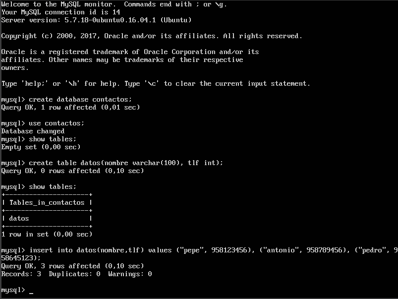
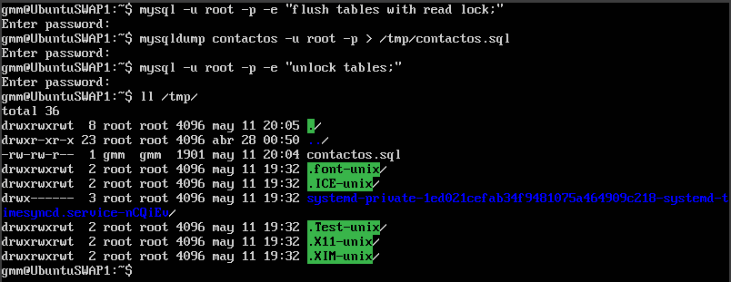
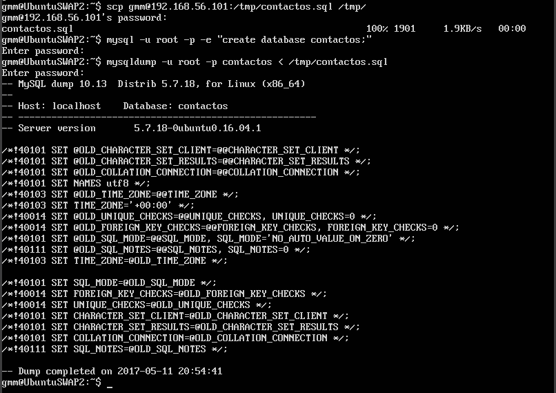
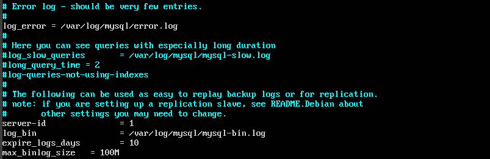
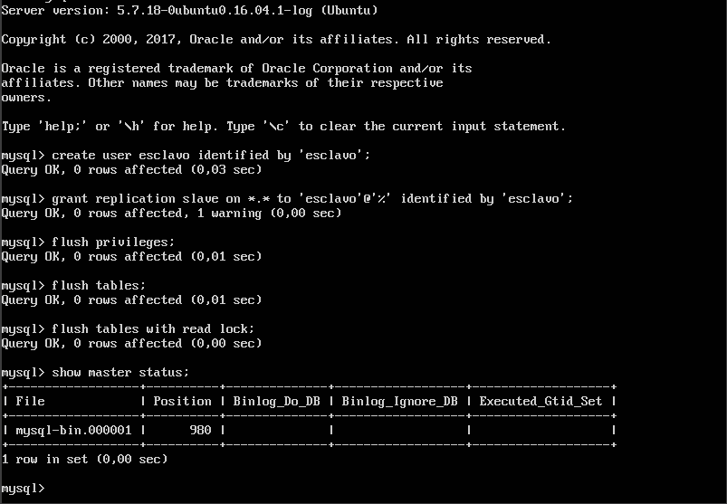
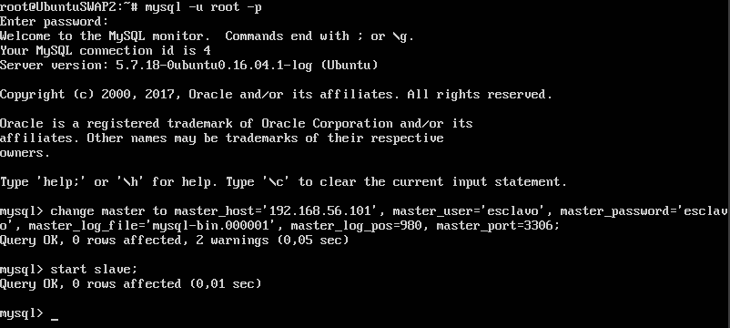
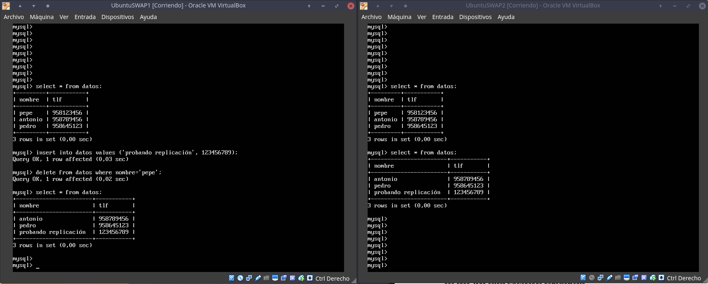

# Práctica 5

#### Guillermo Montes Martos | 11/05/2017

 

### 1. Creación de una BD

En este apartado realizaremos la creación de una base de datos y una tabla, así como introduciremos algunas tuplas en dicha tabla. Para ello, es necesario tener instalado un servidor de base de datos. En nuestro caso, ya instalamos un servidor MySQL en la primera práctica, así como el cliente.

Todo lo que tenemos que hacer es entrar en el cliente MySQL como usuario root (para tener acceso a todo) y creamos lo especificado antes, siguiendo el ejemplo proporcionado por el profesor en el guión de prácticas.

 

### 2. Backup de una BD

Para la realización de esta tarea, usaremos la herramienta *mysqldump*, la cual se incluye en el cliente de MySQL. Esta realiza copias de seguridad de la base de datos que le especifiquemos y usaremos la redirección de salida para guardarla en un archivo.

Para evitar que se realicen cambios en la BD durante la creación del **backup**, lo ideal es bloquear las tablas. Una vez realizado, podremos desbloquearlas para su correcto uso. Así pues el resultado lo podemos ver en la siguiente imagen. Como nota aclaratoria, se ha usado el argumento *-e* del comando *mysql* para que ejecute la sentencia sin entrar directamente en el cliente, mejorando la visibilidad de la captura.

 

### 3. Restauración de un backup de una BD

Para este apartado, usaremos la copia de seguridad creada anteriormente y trataremos de restaurarla en la segunda máquina servidora. Para ello, lo primero que deberíamos de hacer es copiar el archivo que contiene el backup a la segunda máquina, mediante el comando *scp* que ya conocimos anteriormente.

El siguiente proceso será la creación de la BD y su restauración. Para lo primero usaremos el cliente de *mysql*, mientras que para lo segundo, haremos uso de la herramienta **mysqldump** y el fichero copiado de la primera máquina.
El resultado lo podemos ver en la siguiente captura.

 

### 4. Configuración maestro-esclavo entre servidores MySQL

Por último, en este apartado realizaremos una configuración maestro-esclavo entre nuestros servidores. Esta nos será útil para replicar toda acción llevada a cabo en el servidor 1 a nuestro servidor 2, de manera que podemos contar con un backup en continua actualización.

Lo primero que tendremos que hacer es abrir el fichero de configuración */etc/mysql/mysql.conf.d/mysqld.cnf* en la máquina 1 (maestro) y realizar la modificaciones indicadas en el guión de prácticas. Estos mismos cambios tendremos que realizar en la máquina 2 (esclavo), únicamente cambiando el parámetro *server-id* a valor 2.

Hecho esto, pasamos a establecer los parámetros de conexión en ambas máquinas. Como contamos con una versión actual de MySQL, estos ajustes tendremos que hacerlos desde el cliente de MySQL. El primer paso se realizará en el maestro, creando un usuario y otorgándole permisos para la replicación.

El segundo paso consistirá en establecer en el servidor esclavo qué máquina será la maestra. Para ello, tendremos que ejecutar la siguiente orden, cambiando los parámetros por los adecuados en nuestro caso, ya sea referente a la dirección IP o al usuario encargado de la replicación.

Con toda la configuración realizada, procedemos a realizar una prueba para comprobar que todo se ha hecho correctamente. Para ello, añadimos y borramos tuplas desde la máquina maestra, confirmando como efectivamente estas se actualizan en la máquina esclava.

 
