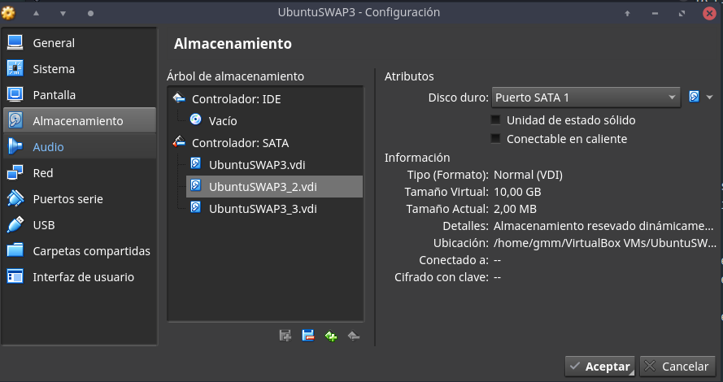
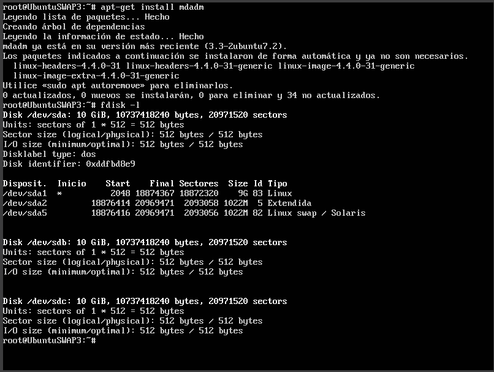
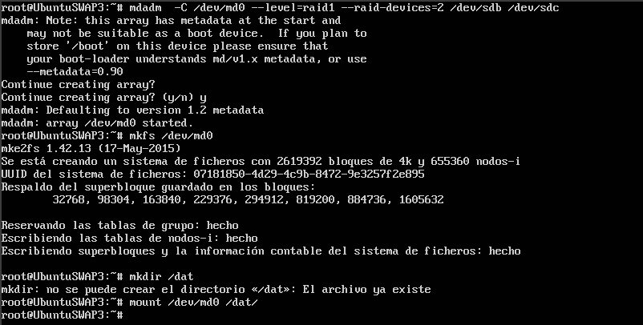
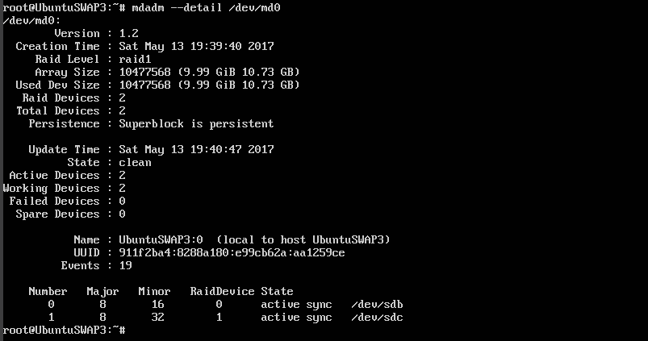
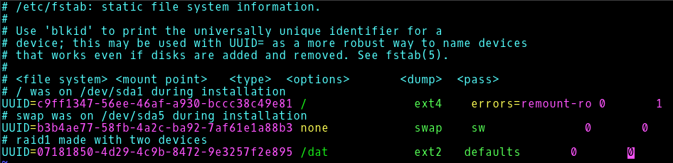
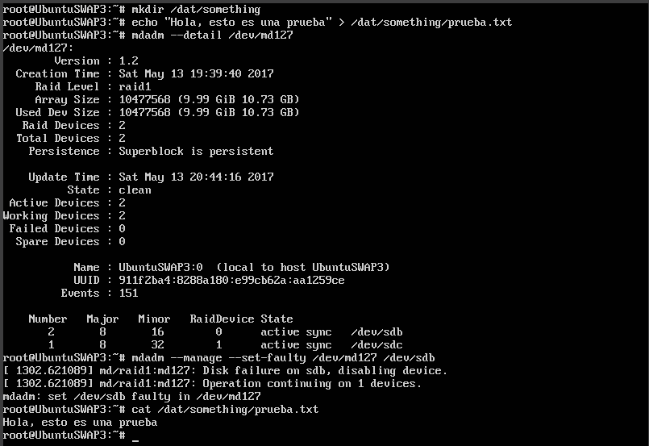
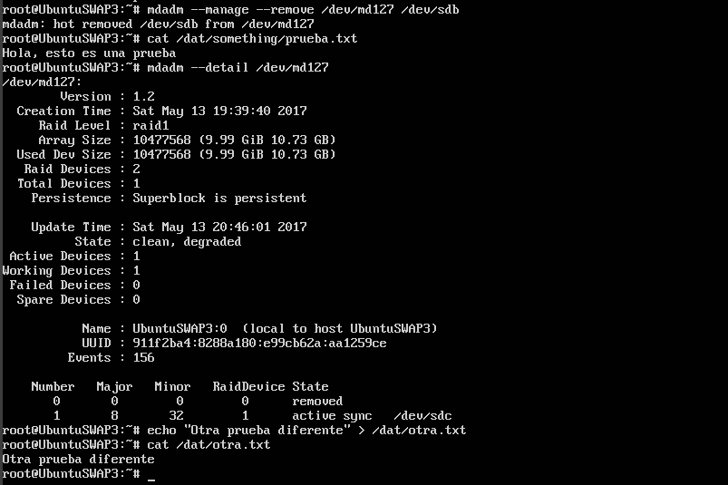
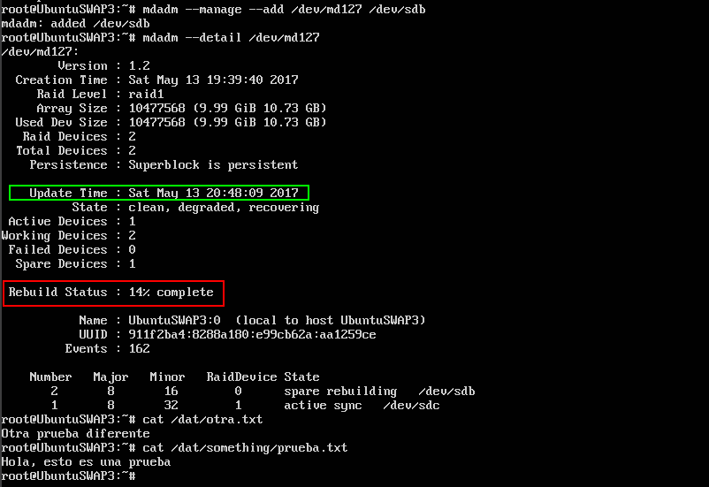
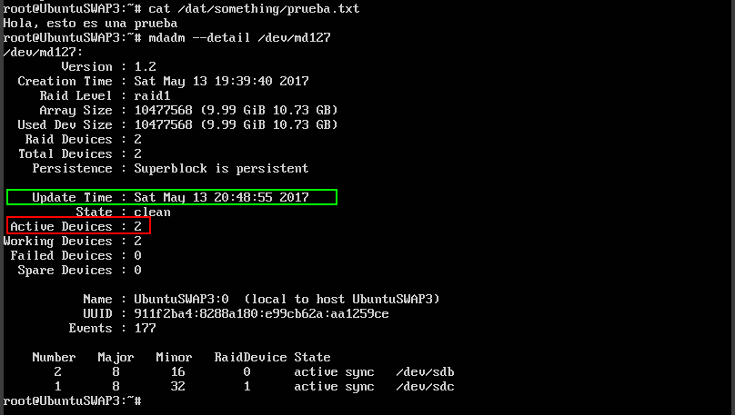

# Práctica 6

#### Guillermo Montes Martos | 12/05/2017

<br>

### 1. Configuración de un RAID1 por software

Para la realización de esta práctica, usaremos dos discos creados con el mismo tamaño que el disco principal (10GB). Estos los crearemos de manera normal desde la configuración de nuestra máquina virtual.



Una vez creados, podemos encender la máquina y pasar a la configuración del **RAID1 por software**. Ejecutando la siguiente instrucción, podemos ver si los discos creados están conectados correctamente a la máquina.

```shell
fsdisk -l 
```



Ambos discos se encuentran conectados, así que podemos proceder a la configuración. Para ello **creamos el raid** en el dispositivo */dev/md0*, especificando el tipo de raid (raid1), el número de dispositivos vinculados (2) y su ubicación. También es importante darle formato, en nuestro caso *ext2*, ya que dejamos todos los parámetros de la orden *mkfs* por defecto. Con el dispotivo activo, creamos una nueva carpeta en el directorio raíz y la montamos en ella.





Sin embargo, **esta configuración no es duradera** ya que una vez apaguemos la máquina, se deshará. Es por ello por lo que necesitamos modificar el archivo */etc/fstab* y añadir el montaje automático de este dispotivo. Lo ideal sería nombrándolo mediante su UUID, el cual podemos encontrar ejecutando el siguiente comando:

```shell
ls -l /dev/disk/by-uuid/
```

Una vez obtenido, añadimos la línea correspondiente al fichero */etc/fstab* para que se monte automáticamente en la carpeta */dat* creada con anterioridad. 




<br>

### 2. Pruebas con el RAID1

Nuestro RAID1 ya está perfectamente configurado y funcionando, es hora de probar su funcionamiento en caso de errores. Para ello, **simularemos un fallo** en uno de los discos y lo **retiraremos**, comprobando la estabilidad y la integridad del RAID1. Antes de empezar y como nota aclaratoria, se hace saber que la máquina ha sufrido un reinicio desde que se creó la configuración del RAID1, por lo cual el dispositivo ha pasado de llamarse */dev/md0* a */dev/md127*.

Comenzamos creando un fichero en la carpeta */dat*, que es la ubicación en el sistema de ficheros de nuestro RAID1. Comprobamos su estado para confirmar que están los **dos discos funcionando**, tras lo cual simulamos un fallo en uno de ellos (en nuestro caso, en el disco 1, correspondiente a */dev/sdb*) y comprobamos como podemos acceder al fichero creado con normalidad.



Pasamos ahora a **remover el disco** en el cual simulamos el fallo y verificamos el estado del fichero, así como el del RAID1. Para continuar nuestra prueba y, aprovechando que solo tenemos un disco conectado, creamos otro fichero con un contenido diferente.



El objetivo ahora es **añadir el disco** retirado anteriormente y comprobar la integridad del RAID1, así como confirmar la **restauración automática** que se produce entre ambos discos. Como se puede comprobar en la siguiente captura, la reconstrucción se estaba llevando a cabo, terminando unos segundos más tarde con éxito.






<br>
