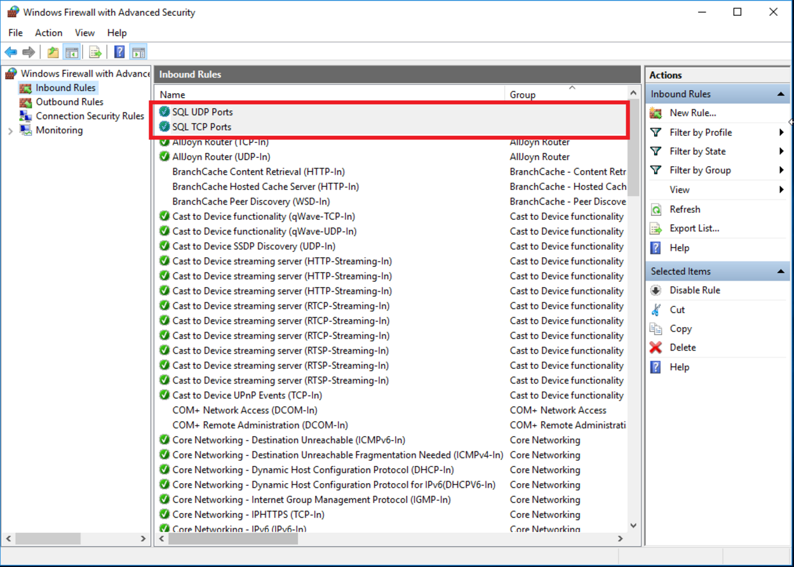

# Tema 3

#### Guillermo Montes Martos | 09/04/2017

<br>

##### 1. Buscar con qué órdenes de terminal o herramientas gráficas podemos configurar bajo Windows y bajo Linux el enrutamiento del tráfico de un servidor para pasar el tráfico desde una subred a otra.

En **Linux**, contamos con el comando *route*, una orden que nos permite enrutar el tráfico de un servidor desde una subred a otra. En su [documentación](https://linux.die.net/man/8/route) podemos encontrar todas sus opciones de uso, pero dada la dificultad, podemos usar alguno de los [tutoriales de Red Hat](https://access.redhat.com/documentation/en-US/Red_Hat_Enterprise_Linux/6/html/Deployment_Guide/s1-networkscripts-static-routes.html) para guiarnos. 

Así pues, podemos usar `ip route` sin argumentos para mostrar la tabla de enrutamiento:


O también podemos, entre otras cosas, añadir una regla para enrutar el tráfico de una subred a una dirección IP concreta añadiendo los argumentos `add <subred> via <IPdestino>`: 


<br>

En **Windows**, más concretamente en su versión para servidores, contamos con una utilidad para la realización de esta tarea, la cual cuenta con interfaz gráfica para simplificar su uso. Se llama [*Routing and Remote Access*](https://technet.microsoft.com/en-us/library/cc731671(v=ws.10).aspx) (*Enrutamiento y acceso remoto*) y podemos activarlo en la configuración del sistema operativo.

Con ella, podremos añadir, borrar o modificar cualquier regla introducida (ya sea persistente o no), además de mostrarlas todas en una tabla. Así sería su interfaz en Windows Server 2008:


<br>

##### 2. Buscar con qué órdenes de terminal o herramientas gráficas podemos configurar bajo Windows y bajo Linux el filtrado y bloqueo de paquetes.

Comenzamos con **Linux**, donde la herramienta más adecuada para esta tarea sería [*iptables*](https://linux.die.net/man/8/iptables), un poderoso firewall para redes IPv4 integrado en el propio kernel de Linux. 

Así, si por ejemplo quisiéramos añadir una regla para rechazar todos los paquetes entrantes de una dirección IP concreta, tendríamos que introducir el siguiente comando:

```shell
sudo iptables -A INPUT -s <direccionIP> -j DROP
```

Sin embargo, su uso es algo enrevesado, por lo cual también se recomienda el uso de firewalls más sencillos, como por ejemplo son [*ufw*](https://help.ubuntu.com/community/UFW) en sistemas basados en Debian o [*firewalld*](https://access.redhat.com/documentation/en-US/Red_Hat_Enterprise_Linux/7/html/Security_Guide/sec-Using_Firewalls.html) para sistemas basados en Red Hat.

<br>

En **Windows** contamos también con un potente [firewall](https://technet.microsoft.com/es-es/library/cc753558(v=ws.11).aspx) integrado en el propio SO. Este, que cuenta con interfaz gráfica, nos permite añadir reglas para omitir, rechazar o bloquear paquetes, en ese orden de importancia.



Estas reglas podremos configurarlas casi al máximo, ya que seremos capaces de elegir para qué aplicaciones tienen efecto, qué puertos actúan, el tipo de protocolo, etc.


