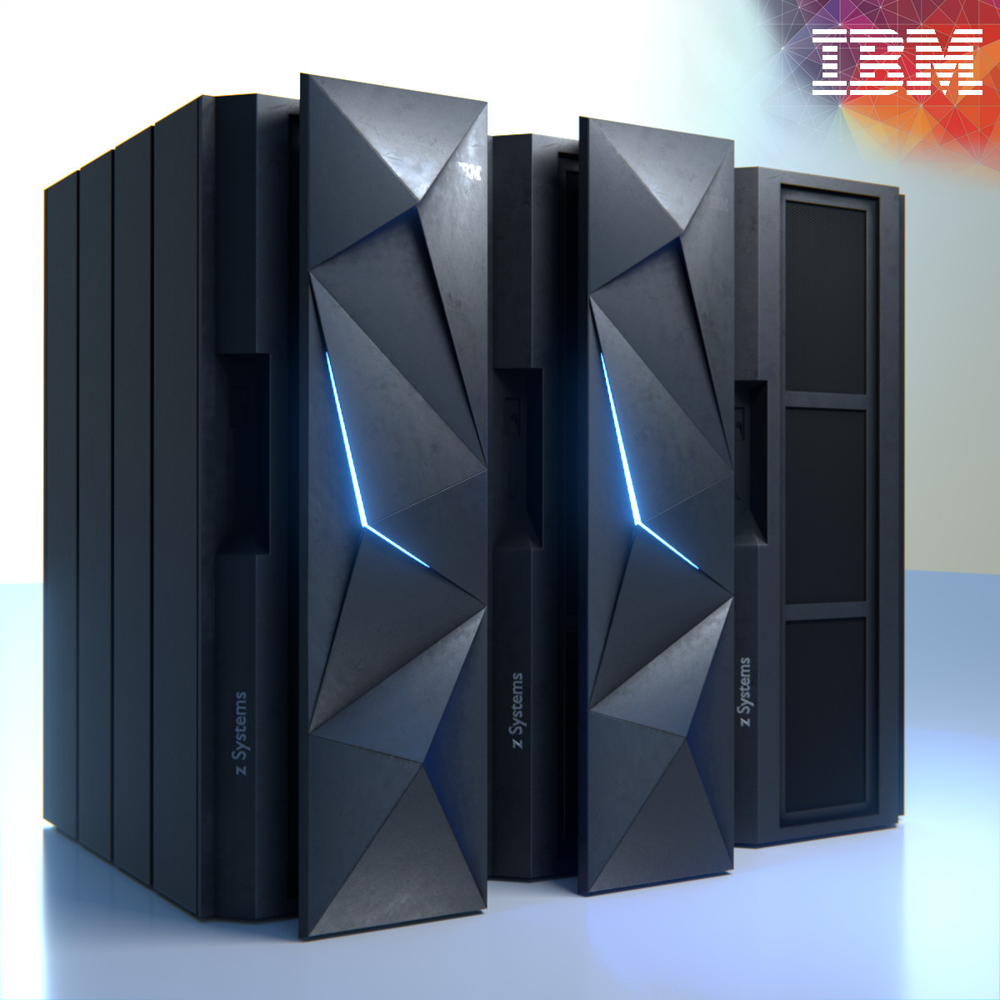
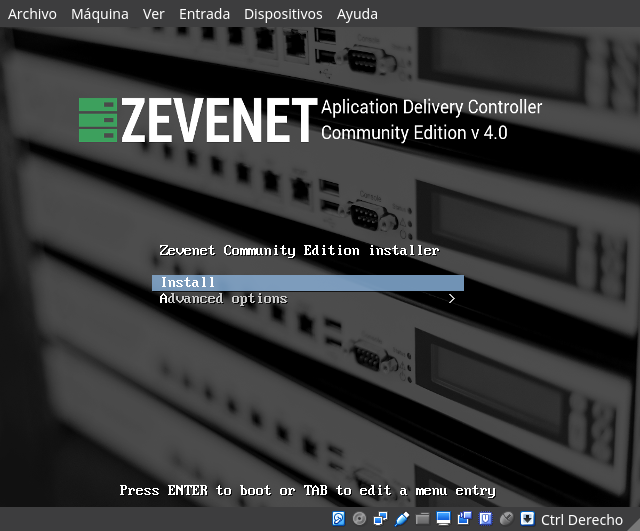
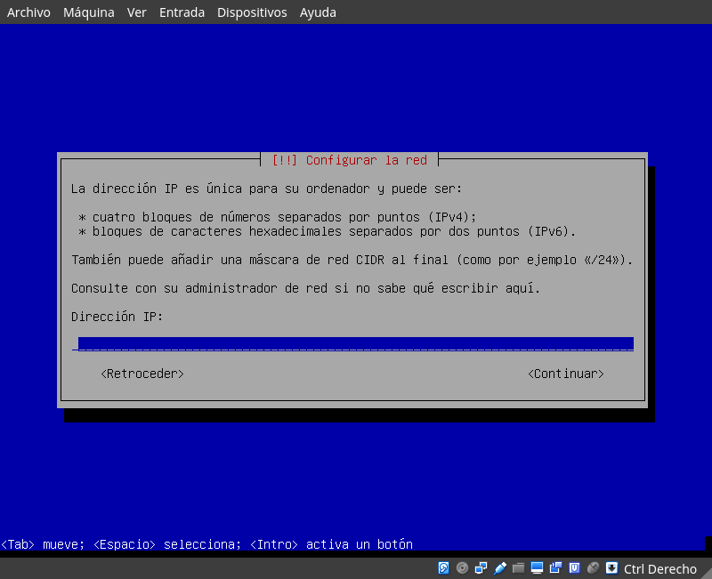
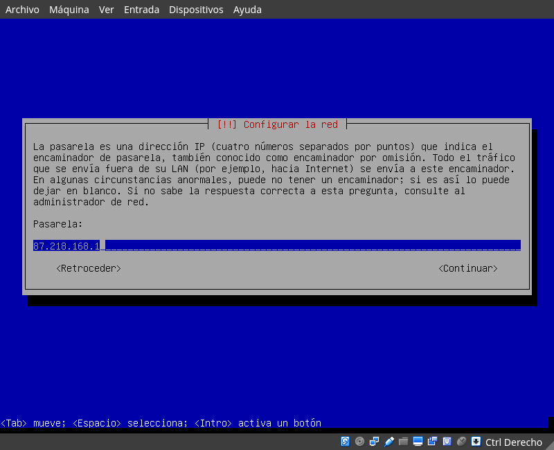
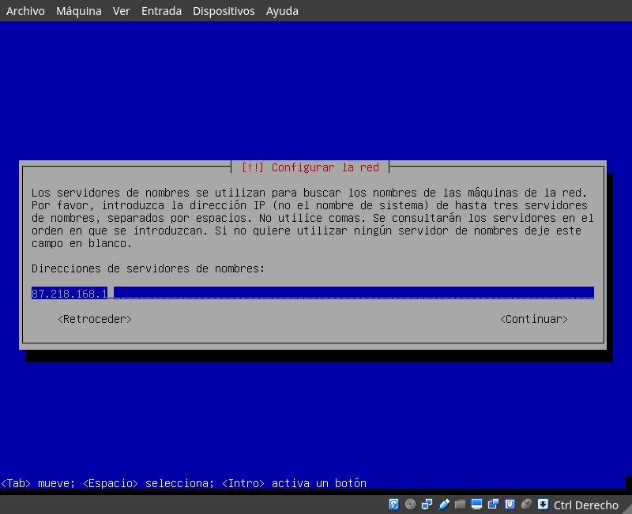

# Tema 4

#### Guillermo Montes Martos | 12/04/2017

<br>

##### 4.1. Buscar información sobre cuánto costaría en la actualidad un mainframe. Comparar precio y potencia entre esa máquina y una granja web de unas prestaciones similares.

Un mainframe podría considerarse como un *superservidor*, capaz de procesar altos volúmenes de tareas y datos en paralelo sin apenas inmutarse. Estos, sin embargo, no son nada accesibles, dada su avanzada tecnología basada en hardware propietario. Por ejemplo, el último modelo de mainframe desarrollado por IBM, el [IBM Z13](https://www-03.ibm.com/systems/es/z/hardware/z13.html), dedicado especialmente para el tráfico de dispositivos móviles, costaría entre $75.000 y $4.000.000 (el precio de este varía según los servicios de mantenimiento contratados).



Sin embargo, el uso de mainframes ha caido en picado en favor de las granjas de servidores. Entre los multiples motivos existentes, destaca el menor precio de este tipo de tecnología, ya sea en la compra inicial del hardware o en su posterior mantenimiento. Es difícil hacer una estimación de los nodos necesarios en una granja web para simular el rendimiento de un mainframe, pero según varias estimaciones vistas en algunos foros especializados, el ahorro puede ser en torno al 50% del precio.

<br>

##### 4.2. Buscar información sobre precio y características de balanceadores hardware específicos. Compara las prestaciones que ofrecen unos y otros.

Los precios son muy variados dependiendo de las especificaciones de cada uno, pero podemos encontrar los más básicos y sencillos por precios cercanos a los 400€. No se ha podido establecer una cota superior de precio por la gran cantidad de productos en el mercado. Comparamos estos dos ejemplos.

- Zevenet ZNA6508 Hardware Appliance (precio base de 2.795€): CPU Intel® CoreTM i5-6500, Base Frequency 3.20 GHz with 4 cores, Memory  DDR4 2133 MHz, ECC, max. 32 GB (Default 4GB), LAN Intel i210, 6 x RJ45 GbE ports, 2 pairs Gen.3 LAN bypass, Storage 1 x full-size mSATA slot (Default 16GB), Console 1 x RJ45, Expansion Slot  1 x PCIe, USB 2 x USB 3.0 type A
Power Supply, 220W single power supply unit, AC 90 ~ 264V @ 47~63Hz, Dimensions  1U: 438 (W) x 44 (H) x 321 (D) mm, or 17.2” (W) x 1.73” (H) x 12.63” (D), Weight  6 kg, Operating Temperature   0 ~ 40°C, or 32°F ~ 104°F, Storage Temperature -20° ~ 70°C, or -4°F ~ 158°F, Operating Humidity  5 ~ 90%, non-condensing, Cooling System  2 cooling silent fans, Certification EMC   CE Class A, FCC Class A, RoHS.

- Barracuda Load Balancer 240 Appliance (precio en torno a 1.400€): 100 Mbps Maximum Throughput, 10 Real Servers Supported, HTTP Throughput, HTTPS (SSL) Throughput, Max. Compression Throughput, 500,000 Layer 4 Concurrent TCP Connections, 40,000 Layer 4 TCP Connections per sec, HTTP Connections per sec
HTTPS (SSL) Terminations per sec (2K Keys). The Barracuda Load Balancer is designed to provide fast and comprehensive IP load balancing capabilities to any IP-based application, including: •  HTTP •  HTTPS (SSL) •   SSH •   SMTP •  IMAP •  RDP (Terminal Services) •   POP3 •  NTP •   ASP •   Streaming Media •   DNS •   LDAP •  RADIUS •    TFTP •  Other TCP/UDP based services

<br>

##### 4.3. Buscar información sobre los métodos de balanceo que implementan los dispositivos recogidos en el ejercicio 4.2

Ha sido imposible encontrar información sobre los métodos de balanceo de carga de los dispositivos recogidos en el anterior ejercicio. Los proveedores mantienen una política cerrada al respecto.

<br>

##### 4.4. Instala y configura en una máquina virtual el balanceador ZenLoadBalancer.

Desde el verano de 2016, ZenLoadBalancer se unió a Sofintel IT Engineering, de manera que quedó integrado en el producto [Zevenet](https://www.zevenet.com/blog/zen-load-balancer-becomes-zevenet/) de la misma compañía. Así pues, descargamos la ISO desde [sourceforge](https://sourceforge.net/projects/zevenet/files/latest/download) y procedemos a su instalación.

El proceso de instalación es similar al que seguiríamos con una distribución Linux (de hecho, la ISO proporcionada no es más que una imagen de Debian 8 con Zevenet preinstalado), pero añadiendo algunos pasos adicionales relativos a la configuración del balanceador de carga.










<br>

##### 4.5. Probar las diferentes maneras de redirección HTTP. ¿Cuál es adecuada y cuál no lo es para hacer balanceo de carga global? ¿Por qué?

Si queremos elegir la forma adecuada, debemos de hacer un primer filtrado de todas las posibles maneras de redirección ofrecidas en el tema, de las cuales nos quedamos con las dos escritas en **PHP**. El motivo es claro: estas redirecciones tienen lugar en la parte servidora y no en el cliente, de manera que ahorramos una petición al servidor y, por lo tanto, la carga de este será menor. 

Una vez realizado ese filtro, debemos elegir entre las dos restantes. La primera cuenta con un método bastante sencillo (aunque, como corrección, le falta un *case 'default'*). La segunda cuenta con un método más avanzado, pero también más difícil de mantener, dada la complejidad de la expresión regular desplegada.

De esta manera, podríamos concluir que las **mejores** son las **dos opciones PHP**, siendo la primera para páginas web donde las opciones de redirección sean poco cuantiosas y la segunda para todo lo contrario.

Por otro lado, está bastante claro que la **peor** opción de todas es la **HTML**, ya que no se ajusta al balanceo de carga global (es imposible redireccionar al servidor más cercano) y necesita de varias peticiones al servidor para llevar a cabo la redirección. 

<br>

##### 4.6. Buscar información sobre los bloques de IP para los distintos países o continentes. Implementar en JavaScript o PHP la detección de la zona desde donde se conecta un usuario.

Las direcciones IP están repartidas según áreas. Cada una de estas áreas tiene asignado un organismo coordinador encargado de todo este tipo de gestiones. Así pues, en Europa  y África es el *RIPE*, mientras que en Norteamérica y en Sudamérica son *ARIN* y *LACNIC*, respectivamente.

Para la implementación escogida a la hora de detectar la localización geográfica haremos uso de PHP, concretamente de la API *Maxmind GeoIP*. Nos basaremos en el [ejemplo explicado por un usuario](https://stackoverflow.com/questions/20642598/detect-country-city-php-geoip-maxmind) en el conocido foro stackoverflow. En él, explica como instalar la API y hacer uso de ella perfectamente. Se ha comprobado su utilidad y funciona a la perfección.

```php
$user_ip='123.123.123.123';

spl_autoload_register('func888'); 
function func888($class){ 
    include_once(str_replace(array('/','\\'), DIRECTORY_SEPARATOR, dirname(__file__)."/$class.php"));
}
use GeoIp2\Database\Reader; 
try{
    $reader = new Reader(dirname(__file__)."/GeoLite2-Country.mmdb");
    $record = $reader->country($user_ip);
    $reader->close();
    $country_name =  $record->raw['country']['names']['en'];
} catch ( GeoIp2\Exception\AddressNotFoundException $e ){    $country_name = 'not_found';  }

echo $country_name;
// RESULTS -------------- > China
```

<br>

##### 4.7. Buscar información sobre métodos y herramientas para implementar GSLB.

La implementación de un **GSLB** (Global Server Load Balancer) no es una tarea sencilla. Esto conlleva una serie de recursos técnicos y materiales que debemos de poseer para su implementación. En cualquier caso, intentaremos realizar un esquema bastante resumido:

- Debemos de contratar un segundo servidor o CPD, o asegurarnos de que tenemos más de uno, ya que no tiene ningún sentido implementar un GSLB con una sola máquina. Sería interesante que la localiazción de estos se encuentre en los sitios dónde se usa de manera más asidua nuestros servicios, con el objetivo de reducir los tiempos de carga al máximo.
- Tendremos que configurar el balanceador de carga según el método de GSLB elegido y adaptar los distintos sistemas existentes (cortafuegos, routers, etc.) a su introducción.
- Es necesario replicar la información de ambos servidores o CPD, ya que el mismo usuario podría acceder a nuestro servicio conectándose a varios servidores en sesiones distintas.
- Podremos detectar la situación geográfica del usuario y redireccionarlo al servidor más cercano que esté disponible.
 
