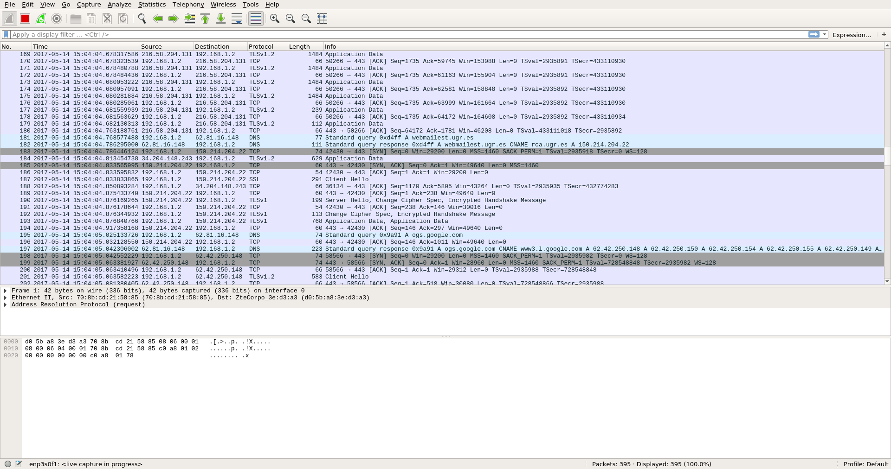

# Tema 5

#### Guillermo Montes Martos | 14/05/2017

___

#### 1. Buscar información sobre cómo calcular el número de conexiones por segundo. Para empezar, podéis revisar las siguientes webs: [http://bit.ly/1ye4yHz](http://bit.ly/1ye4yHz) y [http://bit.ly/1PkZbLJ](http://bit.ly/1PkZbLJ)

Si nuestro servidor web se trata de **Nginx**, no tendremos problema alguno, ya que este cuenta con un módulo llamado *HttpStubStatusModule*, el cuál nos permite, entre otras cosas, medir el número de conexiones abiertas, conexíones por segundo, etc. Para activarlo, tan solo tendremos que modificar el fichero de configuración de Nginx añadiendo lo siguiente:

```
 location /nginx_status {
    # Turn on stats
    stub_status on;
    access_log   off;
    # only allow access from 192.168.1.5 #
    allow 192.168.1.5;
    deny all;
}
```

Tras lo cual es necesario reiniciar el servidor web y acceder a la url ```http://dirección-ip/nginx_status``` tal y como se puede ver en la siguiente imagen, tomada desde [http://bit.ly/1ye4yHz](http://bit.ly/1ye4yHz).


Si contamos con un servidor Apache, tenemos un moduflo similar llamado [mod_status](http://httpd.apache.org/docs/2.0/mod/mod_status.html), el cual es posible de activar modificando el fichero de configuración de Apache y accedienco al sitio ```http://dirección-ip/server-status```.

En cualquier otro caso, es posible usar la herramienta [*netstat*](https://linux.die.net/man/8/netstat), una utilidad que nos muestra todo tipo de estadísticas sobre conexiones de red en sistemas Linux. Combinándola con otros comandos, podemos obtener aquello que buscamos.

```shell
# Contador de conexiones http
> netstat | grep -c http | wc -l
```
___

#### 2. Revisar los análisis de tráfico que se ofrecen en [http://bit.ly/1g0dkKj](http://bit.ly/1g0dkKj). Instalar wireshark y observar cómo fluye el tráfico de red en uno de los servidores web mientras se le hacen peticiones HTTP.

Wireshark es una herramienta gráfica que nos permite analizar los paquetes que circulan por nuestra máquina e, incluso, por nuestra red si es abierto en modo promiscuo. En otras palabras, es lo que se llama un *sniffer*.

Está disponible para casi todos los SO, así que podríamos instalarlo en uno de los servidores usados en prácticas mediante *apt-get*. Es importante acceder a nuestro servidor mediante SSH desde una máquina con servidor X11 y con el parámetro *-X*, para poder obtener la interfaz gráfica de este programa.

Una vez abierto, seleccionamos la red que queremos analizar y podemos ver todos los paquetes que circulan, los cuales podemos filtrar mediante [reglas](https://wiki.wireshark.org/), de manera que podamos obtener información de cierto valor.



___


#### 3. Buscar información sobre características, disponibilidad para diversos SO, etc de herramientas para monitorizar las prestaciones de un servidor.
+ [top](https://linux.die.net/man/1/top): esta herramienta no es más que un **monitor dinámico** del sistema en tiempo real. Muestra información resumida sobre el consumo de recursos del computador, así como una lista de los **procesos en ejecución**, los cuales podemos manipular de manera interactiva. Se puede encontrar en todos los sistemas con base Unix, como Linux o MacOS.
+ [vmstat](https://linux.die.net/man/8/vmstat): esta utilidad disponible es sistemas Unix nos ofrece estadísticas de **uso de la memoria virtual**, tales como memoria usada por procesos, paginación, bloques de E/S, etc, así como de la **CPU**.
+ [netstat](https://linux.die.net/man/8/netstat): este comando nos brinda un listado de las **conexiones activas** de nuestro sistema, ya sean entrantes o salientes. Se puede encontrar tanto en sistemas basados en Unix como en Windows.
+ [perfmon](https://technet.microsoft.com/en-us/library/cc749115(v=ws.11).aspx): esta herramienta perteneciente a sistemas Windows nos da la posibilidad de ver datos históricos o en tiempo real sobre el **rendimiento del equipo**, así como información de los logs del sistema. Podría considerarse como una versión avanzada del *Administrador de tareas*.

___