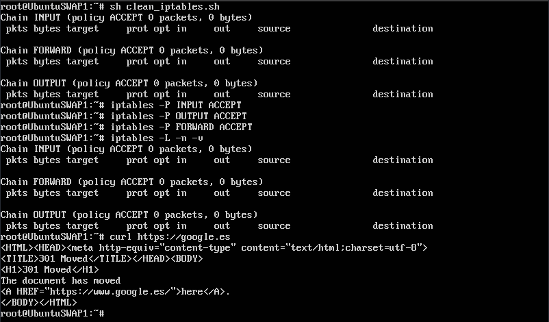

# Tema 6

#### Guillermo Montes Martos | 16/05/2017

___

#### 1. Aplicar con iptables una política de denegar todo el tráfico y otra para permitir todo el tráfico en una de las máquinas de prácticas. Comprobar el funcionamiento de ambas.

Para denegar todo el tráfico, podemos aplicar las reglas vistas en el guión de la práctica 4. Comprobamos su funcionamiento ejecutando la orden [curl](https://linux.die.net/man/1/curl), la cual realiza transferencias de páginas web.

```shell
# Eliminar las reglas existentesiptables -F
iptables -F
iptables -X
iptables -Z
iptables -t nat -F

# Denegar todo el tráfico
iptables -P INPUT DROP
iptables -P OUTPUT DROP
iptables -P FORWARD DROP
```


Por el contrario, si queremos permitir todo el tráfico, tanto entrante como saliente, tendremos que aplicar las siguientes reglas. Probamos su funcionamiento de la mimsa manera, encontrando ahora un resultado satisfactorio.

```shell
# Eliminar las reglas existentes
iptables -F
iptables -X
iptables -Z
iptables -t nat -F

# Permitir todo el tráfico
iptables −P INPUT ACCEPT
iptables −P OUTPUT ACCEPT
iptables −P FORWARD ACCEPT
```




___

#### 2. Comprobar qué puertos tienen abiertos nuestras máquinas, su estado, y qué programa o demonio lo ocupa.

Hay varias herramientas en sistemas Linux para comprobar los puertos que tenemos abiertos en nuestra máquina. Una de ellas es el comando [netstat](https://linux.die.net/man/8/netstat), el cual acompañado de los parámetros adecuados, es capaz de mostrar los puertos abiertos, su estado y el programa que los ocupa.


___


#### 3. Buscar información acerca de los tipos de ataques más comunes en servidores web (p.ej. secuestros de sesión). Detallar en qué consisten, y cómo se pueden evitar.

+ [DDoS](https://es.wikipedia.org/wiki/Ataque_de_denegaci%C3%B3n_de_servicio): Un ataque DDoS o Denegación de Servicio es una de las formas más comunes de atacar un servidor web. Básicamente, consiste en inundar el servidor web de peticiones, de manera que este se sature y no sea capaz de responder a todas o, incluso, llegue a bloquearse. Este tipo de ataque se realiza mediante botnets, que son los encargados de inundar el servidor de peticiones, de manera que este desatienda las peticiones de usuarios comunes.

+ [Inyección SQL](https://es.wikipedia.org/wiki/Inyecci%C3%B3n_SQL): es un ataque consistente en modificar una cadena de consulta de base datos correspondiente a un sitio web mediante la inyección de código en la consulta, aprovechando posibles vulnerabilidades de la base de datos. De esta manera, pueden tener acceso a las tablas de esta.

+ [Heartbleed](https://es.wikipedia.org/wiki/Heartbleed): este ataque consiste en aprovechar una vulnerabilidad descubierta en la biblioteca de OpenSSL, una de las bibliotecas de criptografía más usadas en servidores web. Básicamente, esta vulnerabilidad permite que la información protegida por SSL/TLS pueda ser robada. El atacante puede conseguir leer la memoria de un servidor o un cliente, permitiéndole, como ejemplo, conseguir las claves privadas SSL de un servidor.

___