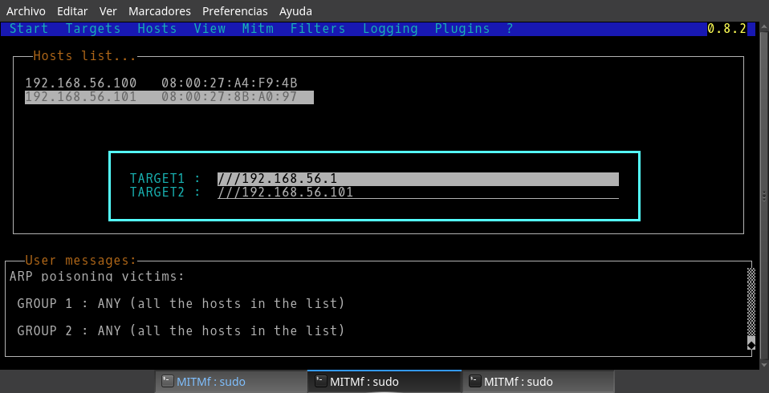
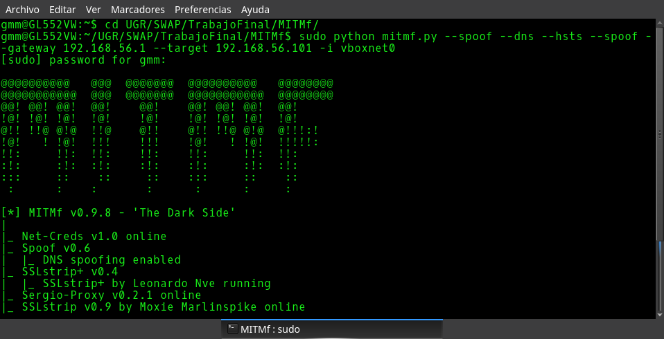
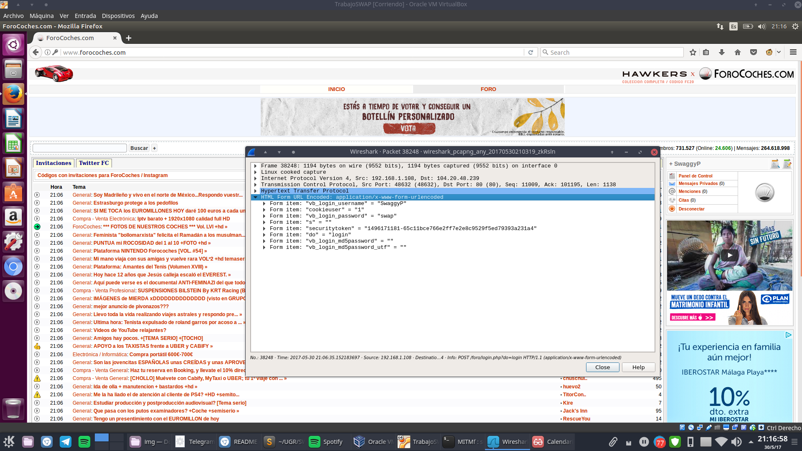
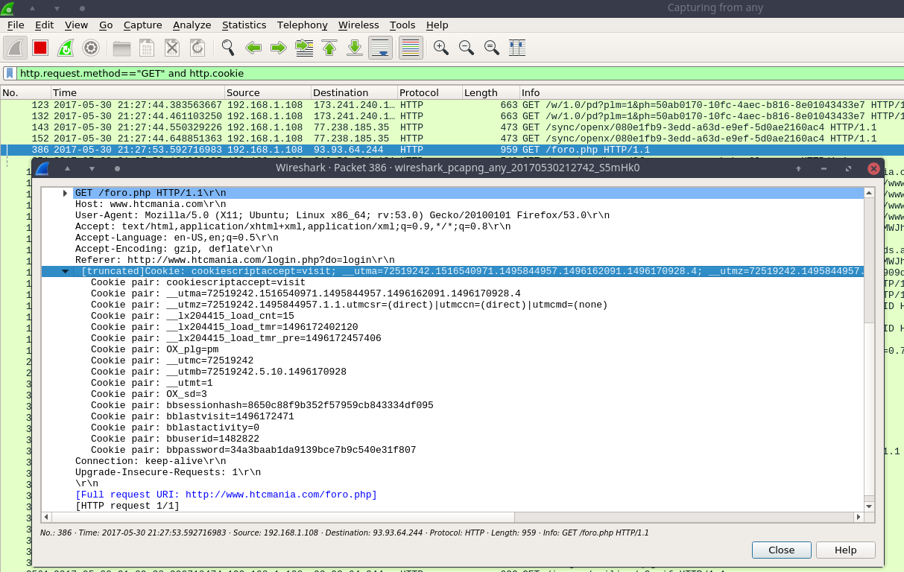
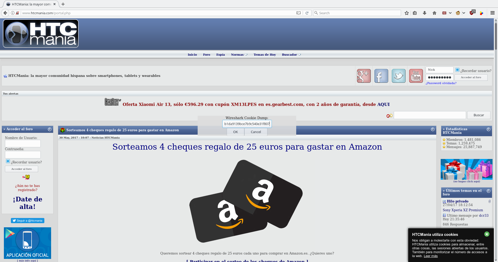
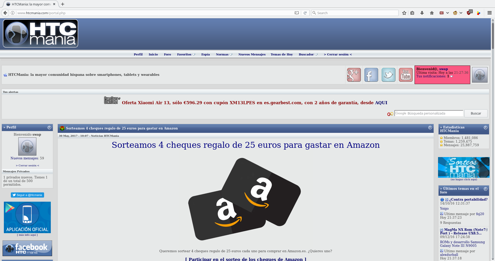
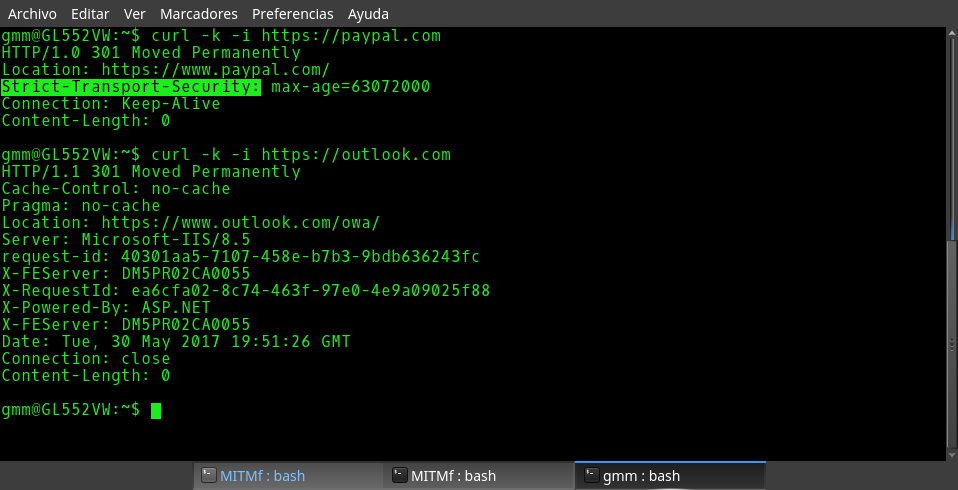

# Ataque MITM (Man In The Middle)

#### Guillermo Montes Martos

 

Este trabajo consta de una primera introducción teórica y 3 demostraciones del ataque MITM con diferente dificultad (las dos primeras realizadas en clase, la última en vídeo).

### 0. Resumen

La seguridad es un tema muy importante en nuestro servidor web. En este trabajo explicaremos uno de los posibles ataques que puede recibir, como es un ataque Man In The Middle (MITM), consistente en la interceptación y/o manipulación de la comunicación entre dos máquinas sin que estas sean sean conscientes de ello. También, detallaremos varios conceptos y herramientas que debemos de conocer para entenderno y llevarlo a cabo, así como realizaremos varios ataques a modo de demostración, desde los más sencillos (ataques sobre páginas web con HTTP y cookie hijacking) hasta los más complicados (sobre webs con HTTPS). 
___

### 1. Introducción teórica

En esta sección se introducen unos pocos **conceptos teóricos** necesarios para entender qué se va a hacer, cómo y por qué. Además, se detallan las herramientas utilizadas y algunas vulnerabilidades a explotar.

Para su presentación, se usó un proyecto de prezi que podemos [encontrar de manera abierta aquí](http://prezi.com/lbj0zbbj0zsj).

___

### 2. Demostración I: Robo de contraseña (HTTP)

En esta parte, realizaremos un ataque MITM a una máquina virtual (entorno controlado), desde la cuál haremos login en una página web sin HTTPS, tras lo cual podremos ver su contraseña con un sniffer.

Lo primero sería buscar los máquinas conectadas a nuestra LAN e identificar a nuestra víctima, pero al tratarse de un entorno controlado, podemos saltarnos este paso. Así pues, ejecutamos [**ettercap**](https://ettercap.github.io/ettercap/) y [**MITMf**](https://github.com/byt3bl33d3r/MITMf) con los parámetros de la máquina virtual (importante establecer la interfaz de red y la puerta de enlace correspondientes a la red interna de VirtualBox).

Una vez hecho, podemos abrir el sniffer **wireshark** (importante, en modo **promiscuo**) y comenzamos el análisis de paquetes. Para esta prueba, ya que necesitamos una página web sin HTTPS, usaremos [forocoches.com](http://forocoches.com). Tras loguearnos, volvemos a wireshark y filtramos los paquetes que contienen el método de HTTP **POST**. Entre todos los paquetes, encontramos uno que nos lleva a la página */foro/login.php?do?=login*, siendo este nuestro objetivo. Al abrirlo, podremos descubrir el nombre de usuario y la contraseña introducidas anteriormente. 

Por último, solo nos quedaría comprobar la información obtenida haciendo login desde un navegador de la máquina anfitriona.

___

### 3. Demostración II: Cookie hijacking

En esta demostración, vamos a robar una **cookie** de la máquina atacada (máquina virtual) y la usaremos para entrar en la sesión del usuario atacado en una página web cualquiera sin HTTPS. Para ello, lo primero que necesitaremos es instalar [GreaseMonkey](https://addons.mozilla.org/es/firefox/addon/greasemonkey/), una extensión de Firefox que sirve para ejecutar scripts en javascript. Este nos hará falta para lanzar [Cookie Injector](http://userscripts-mirror.org/scripts/show/119798), una utilidad en javascript para inyectar una cookie en el navegador y hacer uso de ella.

Con todo hecho y, aprovechando la disposición anterior (máquina virtual atacada con ettercap y MITMf), accedemos desde la máquina atacada a, por ejemplo, [htcmania.com](htcmania.com) y hacemos login. Tras ello, volvemos a wireshark y filtraremos los paquetes por aquellos que hagan uso de GET como método HTTP y que contengan una cookie. Así, escogemos el primer paquete que se produce tras el logueo, copiamos su contenido desde wireshark (cogiendo únicamente las cookies, se debe borrar lo demás) y abrimos un navegador en la máquina atacante. Accedemos a la página (sin loguearnos, como es obvio) y pulsamos *ALT+C* para abrir el pop-up de **Cookie Injector**. Pegamos la cookie copiada anteriormente y recargamos la página, tras lo cuál estamos dentro de la sesión robada.

Es importante aclarar que este método es menos efectivo que obtener la contraseña, ya que, una vez el usuario original cierre sesión, la validez de la cookie termina, cerrándose la sesión que conseguimos abrir en la máquina atacante.

___

### 4. Demostración III: Robo de contraseña (HTTPS)

En esta última sección, robaremos la contraseña de un usuario perteneciente a una **página web con HTTPS**. El servidor elegido será [outlook.com](https://outlook.com), ya que, tras comprobar sus cabeceras, hemos podido comprobar mediante *curl* que no usa **HSTS** (HTPPS Strict Transport Security), un mecanismo que fuerza al navegador a usar únicamente HTTPS. De esta manera, la conexión podrá ser atacada por MITMf.

En este caso el entorno cambia, ya que por problemas de la red interna de VirtualBox no se pudo llevar a cabo en la máquina virtual (y mucho menos en eduroam). Así pues, realizamos la prueba en una **red WiFi convencional** que podemos encontrar en cualquier vivienda hoy en día, siendo la máquina atacada un PC con sistema operativo Windows.

El primer paso sería listar las máquinas conectadas a esa red e identificar nuestro objetivo, para lo cual usamos los comandos *arp* y *nmap*. Lo siguiente sería ejecutar ettercap y wireshark de la misma manera en que lo hicimos anteriormente, únicamente cambiando los parámetros de direcciones IP e interfaz de red.

El resto del proceso se encuentra detallado en [este vídeo](https://drive.google.com/file/d/0B7-JeOSgxpksVVNPbC1yYWhTcVk/view?usp=sharing)

